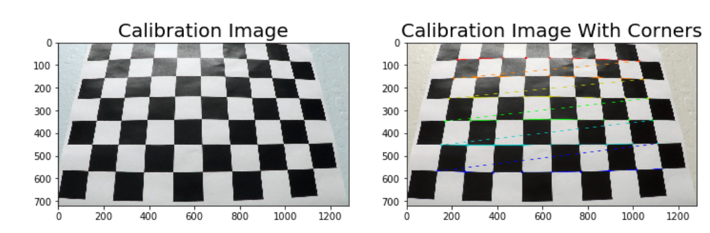
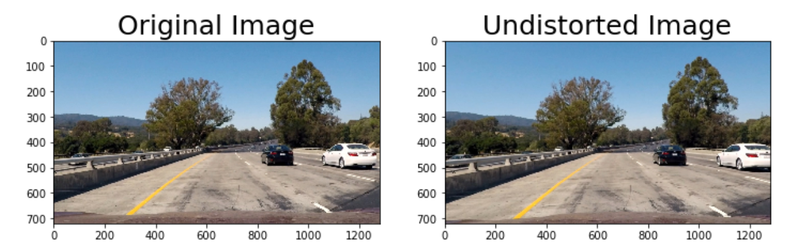
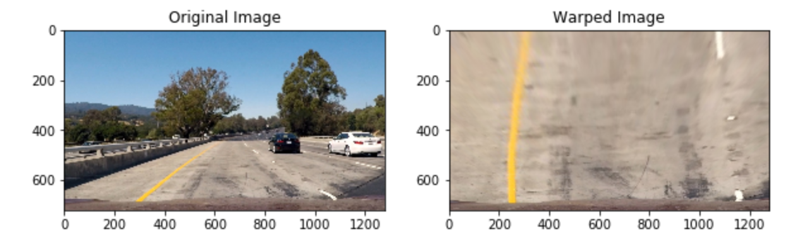
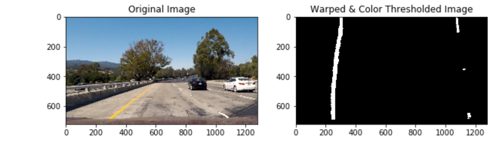
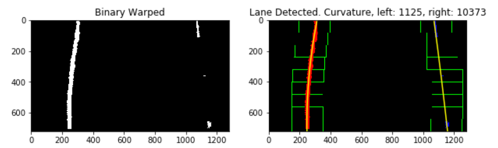
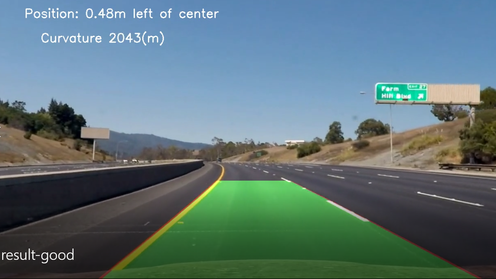

# Advanced Lane Finding

## Udacity Self Driving Car Engineer Nanodegree - Project 4


The goals / steps of this project are the following:
	
	*Compute the camera calibration matrix and distortion coefficients given a set of chessboard images.
	*Apply a distortion correction to raw images.
	*Use color transforms, gradients, etc., to create a thresholded binary image.
	*Apply a perspective transform to rectify binary image ("birds-eye view").
	*Detect lane pixels and fit to find the lane boundary.
	*Determine the curvature of the lane and vehicle position with respect to center.
	*Warp the detected lane boundaries back onto the original image.
	*Output visual display of the lane boundaries and numerical estimation of lane curvature and vehicle position.


General Note: 

Code comments are available on the jupyter notebook, please refer to it for further details

### Step 1: Distortion Correction
Thanks to OpenCV functions `findChessboardCorners` and `drawChessboardCorners` I was able to identify the locations of corners on a set of chessboard pictures taken from different angles .

Example of one picture:



Next step I performed a camera calibration `calibrateCamera` to compute the camera matrix and distortion coefficients. 

Last step was to use the camera calibration matrix and distortion coefficients in combination with the OpenCV function `undistort` to correct distortion from the test images provided.



### Step 2: Bird's Eye View (Perspective Transform)

The purpose of this step was to perform a Perspective Transform to get a 'birds eye' view of the lanes so that they look parallel.

The transformation is a mapping from 4 points (source) to another 4 points (destination). The points were chosen in similar way to the class by "eyeballing" the picture and tuning until a satisfying result has been achieved.

The points src,dst that were chosen are the following

src = np.float32([[488, 480],[808, 480],
                    [1252, 722],[42, 722]])
dst = np.float32([[0, 0], [1280, 0], 
                     [1252, 722],[42, 722]])

The transform is simply obtained by calling the two cv2 functions `getPerspectiveTransform` and `warpPerspective`



### Step 3: Apply Binary Thresholds

This step was a bit tricky and required a lot of trial an error.

During the allotted time to this project I was not successfully able to find a satisfying tuning using gradient thresholding so I only performed color thresholding.

Thanks to the lessons (and also a peak into project 5) I learned about two colors spaces that helped me perform a good thresholding. HLS (Hue Lightness Saturation) and LUV 

I concluded that the following values were good

s_thresh=(180, 255) i.e keeping only the saturation channel and values >= 180 was good in identifying yellow lanes
l_thresh=(200, 255) i.e keeping only the l channel and values >= 200 was good in identifying white lanes

I combined both thresholds to filter out white and yellow lanes



### Step 4: Fitting a polynomial to the lane lines

The lane regions were detected first by relying on a histogram along all the columns.

The two peaks were a good candidates for region to start a search for lanes.

Next step is searching for lanes using sliding windows (9 windows were used)
Then Fitting a polynomial of degree 2 to each lane with the function `numpy.polyfit()`.

### Step 5: calculating vehicle position and radius of curvature:

After fitting the polynomials, the next thing to do was to use those curves to compute the
position of the vehicle from the lane.

This is done simply by computing the delta between both polynomials intercepts and adjusting it to the center of the of the image 

The last step was to correct scale the previous values from pixel to meters.

Please refer to method `plot_back()` for more technical details 

For curvature I used the following code  (similar to the one in the lesson)

```
def curvature(binary_warped, l_fit, r_fit, l_lane_inds, r_lane_inds):
    
    # Define conversions in x and y from pixels space to meters
    ym_per_pix = 30/720 # meters per pixel in y dimension
    xm_per_pix = 3.7/700 # meters per pixel in x dimension
    
    height = binary_warped.shape[0]
    ploty = np.linspace(0, height-1, height)
    y_eval = np.max(ploty)
    
    nonzero = binary_warped.nonzero()
    nonzeroy = np.array(nonzero[0])
    nonzerox = np.array(nonzero[1])
    # Again, extract left and right line pixel positions
    leftx = nonzerox[l_lane_inds]
    lefty = nonzeroy[l_lane_inds] 
    rightx = nonzerox[r_lane_inds]
    righty = nonzeroy[r_lane_inds]

    
    # Fit new polynomials to x,y in world space
    left_fit_cr = np.polyfit(lefty*ym_per_pix, leftx*xm_per_pix, 2)
    right_fit_cr = np.polyfit(righty*ym_per_pix, rightx*xm_per_pix, 2)
    # Calculate the new radii of curvature
    left_curverad = ((1 + (2*left_fit_cr[0]*y_eval*ym_per_pix + left_fit_cr[1])**2)**1.5) / np.absolute(2*left_fit_cr[0])
    right_curverad = ((1 + (2*right_fit_cr[0]*y_eval*ym_per_pix + right_fit_cr[1])**2)**1.5) / np.absolute(2*right_fit_cr[0])
    return left_curverad,right_curverad
```

The curvature that will be displayed at the final stage will be the average of both left and right




### Step 6: Final Output

This was done using the following steps:
	
	* Plot the polynomials on to the warped image
	* Coloring the region between polynomials (trapezoid like region colored with green)
	* Use the Inverse dst->src transform to unwarp the image
	* Print the distance and radius on the final output image




## Video Processing Pipeline:

The pipeline used to process and image consisted of:
	- Camera Calibration
	- Undistortion
	- Bird Eye View
	- Color Thresholding
	

A similar pipeline has been used for the video as well.
The pipelines goes like this:

	For each Frame in the video:
		- Perform the process image for this frame
		- If this result is a good match (good match is detected by checking that the distance between lanes stays roughly the same) Then use the result and move to the next frame also save the frame in case the next frame failed to detect lanes
		- If the result is not a good match (failed to detect lanes) use the previous result
		 as an approximation

The project video can be downloaded here

[link to final video](https://drive.google.com/open?id=13Ei_jwDMJwmGknEf8BHcmylM_eaILQ2z)


### Limitations & Conclusion:

The pipeline developed here was able to successfully detect lane lines on the normal video.
I was unfortunately not able to successfully apply it yet to the advanced video.

I think that by adding appropriate gradient thresholding the detection could be enhanced.

This project made me realize that using only computer vision techniques without relying on Machine Learning involves some tedious work. (Especially tuning all the parameters)

Nevertheless a combination of both Machine learning and computer vision might be a way to tackle this project in the future once I have a chance to revisit it.
    